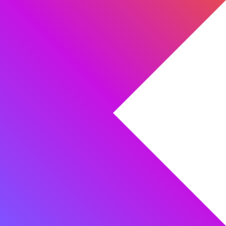

### Hi, I am Hazem, a Software Engineer!

I have extensive experience building user-friendly web and cross-platform mobile applications using React and React Native with TypeScript. Similarly, I have experience building APIs using Node.js and recently using Scala. Recently, I got into DLT (Distributed Ledger Technology) using Corda with Kotlin.

- 💬 Ask me about **React and TypeScript**

- 📫 How to reach me **me@hazemkrimi.tech**

- 📄 Know about my experiences [here](https://hazemkrimi.tech/about)

### Connect with me:

  

### Languages and Tools:

